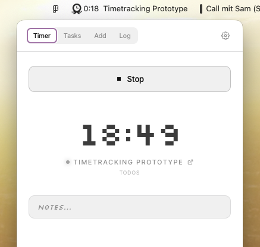

# TimesUp

A menu bar time tracker for ClickUp. Replaces Toggl. Mac + Windows.



## What it does

- Lives in your menu bar / system tray — shows live elapsed time and task name while tracking
- Click the icon → small floating window pops out
- Start/stop a live timer, with or without an assigned task
- Assign a task to a running unassigned timer mid-session
- Quick-start from your in-progress tasks (assigned to you, ordered by last updated)
- Add manual time entries (date, time, duration)
- View today's / last 7 days' log, edit durations, delete entries, restart past entries
- Notes field always visible — saves to ClickUp on blur while tracking
- Idle detection — prompts after configurable inactivity, with option to trim idle time
- Launch at login toggle
- Dark / light / auto (system) theme
- Serif or dotted (pixel) timer font
- All data lives in ClickUp natively (uses `/time_entries` endpoints)

## Quick start (dev mode)

You need **Node.js 18+** installed.

```bash
npm install
npm run dev
```

The app launches automatically. Look for the icon in your menu bar (Mac, top-right) or system tray (Windows, bottom-right).

**First run:** Paste your ClickUp API token. Get it from:

> ClickUp → click your avatar → Settings → Apps → Generate API Token

Or use the **Open ClickUp API settings** link in the onboarding screen — it opens `app.clickup.com/settings/apps` directly.

Then pick your workspace. Done.

## Building installers

For a real `.dmg` (Mac) or `.exe` (Windows):

```bash
npm run build:mac    # produces release/*.dmg  (run on a Mac)
npm run build:win    # produces release/*.exe  (run on Windows)
```

Unsigned builds will trigger a "developer not verified" warning on first launch. Right-click → Open on Mac, "More info → Run anyway" on Windows. For a clean install experience add code-signing certs to `package.json` under `build.mac.identity` / `build.win.certificateFile`.

> **Note:** In dev mode the "Launch at login" toggle registers the Electron binary and will show as "Electron" in macOS login items. This resolves correctly in a signed/packaged build.

## Architecture

```
electron main process  ──► holds the API token, proxies requests to api.clickup.com
   ↓ (IPC bridge)
react renderer         ──► UI, runs in a tiny chromium window
```

The main process acts as a tiny local backend that holds your secret and avoids CORS. The renderer is a standard React app.

## File map

```
src/
├── main/
│   ├── index.js        # tray + window + IPC handlers + idle detection
│   └── preload.js      # safe bridge to renderer (store, clickup, shell, app, idle)
└── renderer/
    ├── App.jsx                  # routes to Setup or Tracker, manages theme + font
    ├── lib/
    │   ├── clickup.js           # API wrapper
    │   └── time.js              # duration formatters / parser
    └── components/
        ├── Setup.jsx            # token + workspace picker
        ├── Tracker.jsx          # shell with tabs + idle prompt integration
        ├── TimerPanel.jsx       # start/stop, task suggestions, notes, last entry
        ├── TaskPicker.jsx       # search + Space → Folder → List → Task drill-down
        ├── ManualEntry.jsx      # add past entries
        ├── History.jsx          # today / 7-day log with restart buttons
        ├── Settings.jsx         # theme, font, idle detection, launch at login, sign out
        └── IdlePrompt.jsx       # overlay shown on idle while tracking
```

## Feature checklist

- [x] Live timer in menu bar (hours:minutes, task name truncated)
- [x] Start unassigned timer (no task required)
- [x] Assign task to a running unassigned timer
- [x] In-progress task suggestions (your tasks filtered to "in progress", newest first)
- [x] Notes field while tracking (saves on blur)
- [x] Open tracked task in ClickUp (external link icon)
- [x] History log sorted newest first, with restart buttons
- [x] Idle detection with configurable threshold and trim-idle option
- [x] Dark / light / auto theme
- [x] Serif / dotted (Silkscreen) timer font toggle
- [x] Launch at login
- [x] Direct link to ClickUp API settings in onboarding

## Ideas to extend

**Workflow**

- [x] **Global hotkey** — `globalShortcut.register('CommandOrControl+Shift+T')` in main to start/stop without opening the window
- [ ] **Auto-set task status** — when you start tracking a task, automatically move it to "In Progress" via `PUT /task/{id}` with `{ status: 'in progress' }`; revert on stop
- [ ] **Pinned tasks** — star up to 5 tasks for permanent one-tap access, stored locally alongside recent history
- [ ] **Task creation** — quick-add a new ClickUp task directly from the tracker without switching to the browser
- [ ] **Tray right-click menu** — expose start/stop and the last few tasks as native OS context menu items for zero-window access

**Time & reporting**

- [ ] **Time rounding** — round stopped entries to the nearest 5/10/15 minutes (configurable); useful for billing workflows
- [ ] **Billable flag** — ClickUp's time entry API supports a `billable` boolean; expose a toggle in the timer and manual entry screens
- [ ] **Tags** — ClickUp time entries support tags; add a tag selector to the timer and manual entry screens
- [ ] **Daily goal** — set a target number of hours per day; show a progress bar in the menu bar title or tray tooltip
- [ ] **Weekly summary** — a read-only report view breaking down tracked time by Space or List over the last 7 days
- [ ] **CSV export** — dump the current log view to a `.csv` file for use in invoicing tools

**Focus & notifications**

- [ ] **Pomodoro mode** — 25-minute work blocks with a 5-minute break; fire a system notification via `new Notification()` at each transition
- [ ] **Break reminders** — notify after N consecutive hours of tracking without a gap; configurable threshold
- [ ] **Tracking reminders** — if the app has been open for X minutes with no active timer, send a nudge notification

**Polish**

- [ ] **Multiple workspaces** — store credentials per workspace and add a switcher; useful for agencies or contractors with multiple ClickUp accounts
- [ ] **Custom "active" statuses** — let the user choose which status names count as "in progress" for task suggestions, instead of hard-coding the string
- [ ] **Linux launch at login** — write a `.desktop` file to `~/.config/autostart/` on Linux where `app.setLoginItemSettings` is a no-op

## Contributing

Pull requests are welcome. The codebase is intentionally small — the entire app is a single Electron main process, a preload bridge, and a handful of React components. No framework magic, no state management library.

Good places to start:

- Pick any unchecked item from the list above
- File a bug if the ClickUp API behaves differently in your workspace (status names, list structures, etc.)
- Improve Windows / Linux support — most of the app works cross-platform but tray behaviour and idle detection have edge cases

## Notes

- API token stored locally via `electron-store` (encrypted on macOS via Keychain when available).
- Polls `time_entries/current` every 10 seconds — stays in sync if you start a timer in ClickUp's web app.
- The window auto-hides when it loses focus. Right-click the tray icon to quit.
- Task suggestions fetch from `/team/{id}/task?statuses[]=in progress` — status name must match your workspace's exact status label.

## License

This tool is open source — MIT licensed. Use it, fork it, ship it. ClickUp itself is a separate product and not affiliated with this project.
