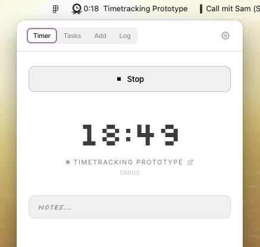

# TimesUp

A menu bar time tracker for ClickUp. Replaces Toggl. Mac + Windows.



## What it does

- Lives in your menu bar / system tray — shows live elapsed time and task name
- Start/stop timers, with or without an assigned task
- Quick-start from your in-progress ClickUp tasks
- Day view — visual timetable with drag-to-create and drag-to-move/resize
- View and edit today's / last 7 days' log
- Idle detection, notes, dark/light/auto theme, launch at login

## Dev

```bash
npm install
npm run dev
```

First run: paste your ClickUp API token (ClickUp → avatar → Settings → Apps → Generate API Token), then pick your workspace.

## Building

```bash
npm run build:mac    # → release/*.dmg  (run on Mac)
npm run build:win    # → release/*.exe  (run on Windows)
```

Unsigned builds will trigger OS warnings. On Mac: `xattr -cr TimesUp.app` or System Settings → Privacy & Security → Open Anyway. On Windows: More info → Run anyway.

## Roadmap

- [ ] External persistent window (toggleable via settings)
- [ ] Create a ClickUp task directly from an unassigned timer
- [ ] Auto-set task to "In Progress" when tracking starts
- [ ] Tray right-click menu (start/stop, recent tasks — no window needed)
- [ ] Billable flag + tags on time entries
- [ ] Weekly summary by Space / List
- [ ] Pomodoro mode + break reminders
- [ ] Multiple workspace support

## License

MIT. Not affiliated with ClickUp.
