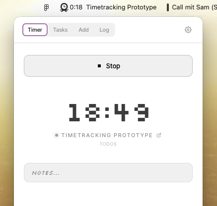

# TimesUp

A menu bar time tracker for ClickUp. Replaces Toggl. Mac + Windows.



## What it does

### Tracking
- Lives in your menu bar / system tray and shows the live elapsed time and task name
- Start and stop timers, with or without a task; a timer without a task carries a note instead
- One field for everything while a timer runs unassigned: type to search tasks, pick one to assign it, or leave the text as the note
- Quick-start from recent and in-progress tasks; full task picker with search across tasks and lists, keyboard-first (arrows, Enter, Left/Backspace to go up, Esc)
- Create a task from anywhere a task can be picked: timer bar, Focus, timetable, task picker, Today cards. One form, name prefilled, list preset to the one you tracked against last
- Tracking time on a task moves it to "in progress" and assigns you, both undoable from one toast and switchable in Settings
- Idle detection: keep, trim or stop the timer after a quiet stretch

### Day and week
- Today: cards per task next to a visual timetable, or a seven-day week view in the window
- Timetable: drag to create, move, resize from either edge; edges snap to neighbouring entries and the current time; optional 15-minute grid
- Entry editor with exact times across midnight, day pickers, task reassignment, delete and resume
- Entries that run past midnight show on the day they started and as a continuation on the next
- Daily goal hairline from your weekly hours and working days

### Pomodoro
- Focus view: timed focus blocks with short and long breaks, big clock, cycle dots, one task at a time
- Breaks are part of the entry by default; the next block starts when the break ends or is skipped. Optionally stop at the end of a block instead
- Countdown in the menu bar, notifications at each phase change, no idle prompts during breaks, the window tints with the phase

### Stats, planning, archive
- Stats: totals by task and list for a day, week, month or all time; admins can see the team
- Log of the last seven days with inline edit and delete
- Plan (admins): capacity planning stored in ClickUp itself, in a dedicated list, so every admin sees the same board without a backend
- Archive: pre-ClickUp time from Toggl CSV exports attached to a tagged ClickUp task, merged into Stats
- CSV export of any period

### App
- Popover from the tray or a persistent window; Plan and Settings open in the window
- Dark, light and auto themes with tones and accents; serif, sans or dotted clock
- Launch at login, auto-update with the installed and incoming version shown in Settings

## Dev

```bash
pnpm install
pnpm dev
```

First run: paste your ClickUp API token (ClickUp → avatar → Settings → Apps → Generate API Token), then pick your workspace.

The main process and preload only reload on a full restart of `pnpm dev`; the renderer hot-reloads.

## Building

```bash
pnpm build:mac    # → release/*.dmg  (run on Mac)
pnpm build:win    # → release/*.exe  (run on Windows)
```

Unsigned builds will trigger OS warnings. On Mac: `xattr -cr TimesUp.app` or System Settings → Privacy & Security → Open Anyway. On Windows: More info → Run anyway.

## Releasing

Bump `version` in `package.json`, commit as `release x.y.z` with the notes in the body (that body becomes the GitHub release notes), tag `vx.y.z`, push main and the tag. The release build runs from the tag.

## Roadmap

- [x] External persistent window (toggleable via settings)
- [x] Create a ClickUp task directly from an unassigned timer
- [x] Auto-set task to "In Progress" when tracking starts
- [x] Weekly summary by Space / List
- [x] Pomodoro mode + break reminders
- [ ] Tray right-click menu (start/stop, recent tasks — no window needed)
- [ ] Billable flag + tags on time entries
- [ ] Multiple workspace support
- [ ] "You" marker on tasks you are assigned to

## License

MIT. Not affiliated with ClickUp.
